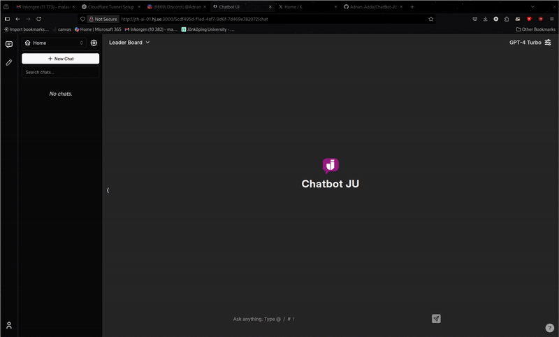

# ChatBot-JU  
Custom chatbot for Jönköping's University

This is a customized chatbot tailored for Jönköping's University. The UI includes feedback buttons for each response from the chatbot (thumb up/down). When the user clicks on the feedback button, the feedback is collected and sent along with the query to an API for collecting feedbacks.  
Every QA pair is sent to a reality check API which responds back with an assessment score that indicates how factually correct the response is.

## UI  

In order to get the reaclity check you need to change the endpoint to the actual one.

To run the UI follow the steps at the original source code of the UI at:
https://github.com/mckaywrigley/chatbot-ui?tab=readme-ov-file

